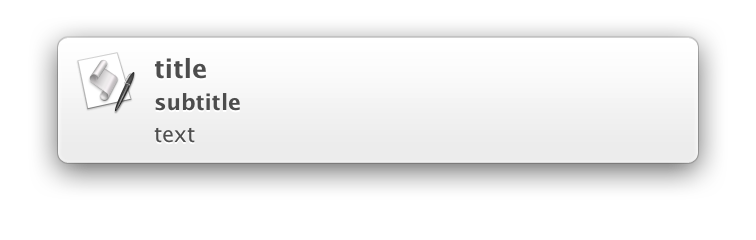

# display-notification [](https://travis-ci.org/sindresorhus/display-notification)

> Display a notification *(OS X 10.9+)*




## Install

```
$ npm install --save display-notification
```


## Usage

```js
const displayNotification = require('display-notification');

displayNotification({
	title: 'Unicorns',
	subtitle: 'Rainbows',
	text: 'Cake',
	sound: 'Bottle'
});
```


## API

### displayNotification(options)

Returns a promise.

#### options

Specify at least a `title` or `text`.

##### title

Type: `string`

Title of the notification.

##### subtitle

Type: `string`

Subtitle of the notification.

##### text

Type: `string`

Content of the notification.

##### sound

Type: `string`<br>
Values: `Basso` `Blow` `Bottle` `Frog` `Funk` `Glass` `Hero` `Morse` `Ping` `Pop` `Purr` `Sosumi` `Submarine` `Tink`

Name of the sound located in `~/Library/Sounds` or `/System/Library/Sounds`:


## License

MIT © [Sindre Sorhus](https://sindresorhus.com)
